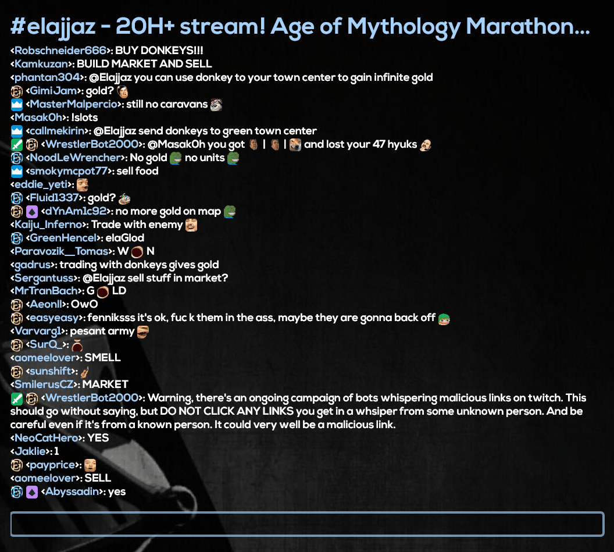

# Twitch Chat for Rainmeter

Twitch Chat for Rainmeter is a plugin for Rainmeter used to view the Twitch chat
right on your desktop with full emote and messaging support!

Please let me know of any issues or missing features you would like added!

**Features**:
* Fully customizable look including width, height, colors etc.
* Emotes and badges.
* Automatically connects to the correct channel when viewed in Chrome.
* Messages can be posted directly from the Rainmeter skin.
* Highlights your own name in chat.
* Hover over images to see their names.
* Clickable links.
* Animated cheers.
* Supports BetterTTV emotes, both gifs and pngs.
* Supports FrankerFacez emotes.

## Installation

1. Install the skin using the .rmskin package.
2. Install the font you want to use for the skin by placing them in the Windows Font folder.
3. Generate an Ouath code at http://www.twitchapps.com/tmi/.
4. Enter your username and the Ouath code in the @Resources\UserSettings.inc file.
5. Customize the settings in the @Resources\Variables.inc file to your liking and make sure to specify the font you installed as well as the location of your Chrome browser.
6. You're all set!

## Usage

To join a channel enter the name of the channel (www.twitch.tv/channel) in the channel input bar.
Alternatively you can used the automatic connection feature which is enabled by default (currently only works with Chrome).
Just navigate to the Twitch channel you want to view and the Skin will automatically connect to the channel.
Manually entering a channel will override the automatic connection feature until the skin is reset.

Once you've joined the channel you can enter messages in the input field below the chat.

## Setting up the development environment

1. Download Visual Studio. Should work with 2015 and above (tested on 2019).
2. Download Rainmeter. Has to be located in `Program Files`.
3. Clone the repository into `Documents\Rainmeter\Skins\Twitch`. This places all skin files in the correct place and makes it easier work with the Rainmeter `.ini` files. You can also place the repository else where but then you have to copy the `@Resources`, `Chat`, and `Viewers` folder into the above directory. 
4. Run Visual Studio as administrator. This is needed to copy the `.dll` file for the plugin into the Rainmeter directory.
5. Open `Plugin/PluginTwitch.sln`.
6. Go to `Project` > `PluginTwitchChat Properties` > `Debug` and select your installed `Rainmeter.exe` under `Start external program`.
7. Select `Start debugging` to run the project in the Visual Studio debugger.

## Credits

Thanks to Malody Hoe, the author of the skin Monstercat Visualizer, on which the meter generation code is based.

Thanks to the authors of the IrcDotNet library which is used to connect to the chat.

## License

Creative Commons Attribution-Non-Commercial-Share Alike 3.0
